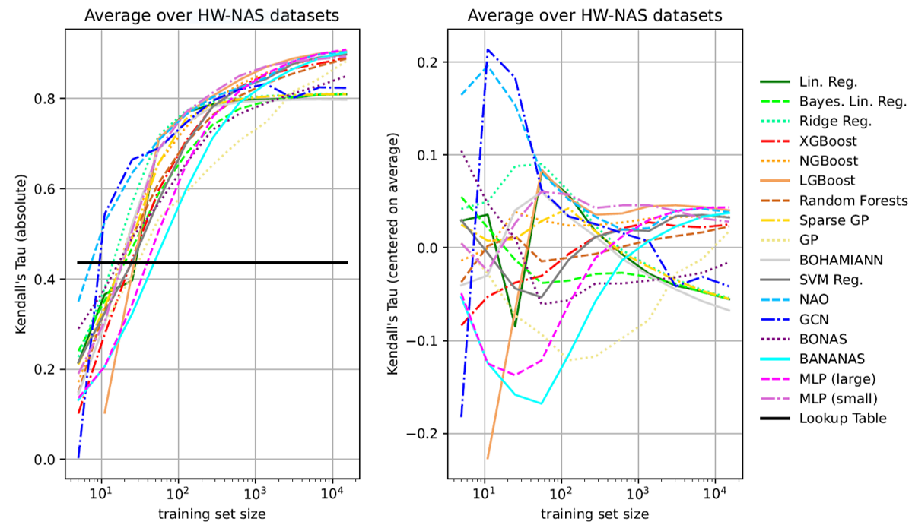
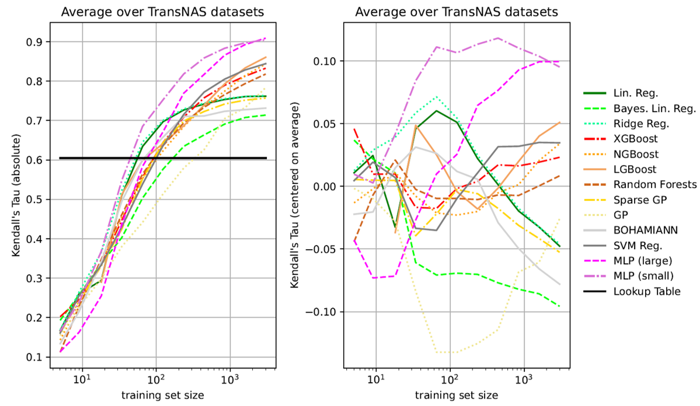
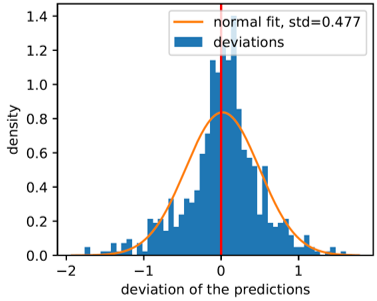
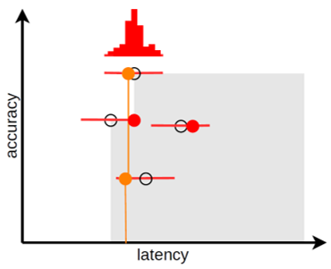
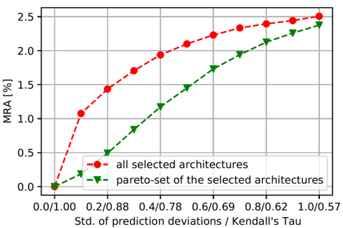
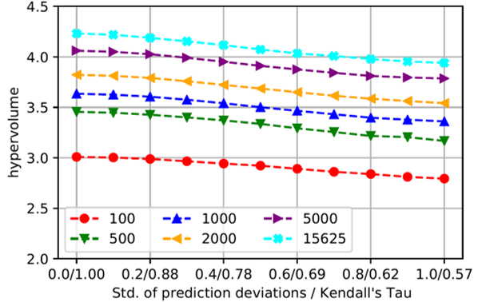

# What to expect of hardware metric predictors in NAS

Official code and results for our AutoML-Conf 2022 submission, based on [NASLib](https://github.com/automl/NASLib).

[Paper on OpenReview](https://openreview.net/forum?id=HHrzAgpHUgq)


---
## Brief paper overview

### The best predictors

First, we evaluate various common prediction methods on diverse combinations of architectures, metrics, and devices.

On [HW-NAS-Bench](https://github.com/RICE-EIC/HW-NAS-Bench):



and [TransNAS-Bench-101](https://github.com/yawen-d/TransNASBench):




### But how do such predictions affect architecture selection?

Secondly, to find out what different Kendall's Tau values mean for the subsequent multi-objective architecture selection, we extensively simulated the selection (right) under incorrect information (left, showing a trained XGB predictor).




Predictors of lower quality (correlation) lead us to selecting worse candidates, measured by a mean reduction in accuracy:



and a reduction in hypervolume:




**For details, have a look at our paper!**


---
## Running the code

### Preliminary

- Set up your python environment. Ours is detailed in *_hw/pipfreeze.txt*,
but includes a number of packages not required for these experiments.

- We provide the datasets and results of predictors/simulation in the default *naslib/data/* directory.
The steps to generate the dataset csv files and results are included for completeness but can be skipped.

- The paths to data/plot/csv directories can be changed in *_hw/utils.py*.


### Run and evaluate predictor experiments

- Create HW-NAS-Bench and TransNAS-Bench-101 lookup data
    ```bash
    python3 _hw/create_csvs.py
    ```

- Create configuration files for all experiments. you can adapt the output paths (s3_folder and out_dir) in the shell scripts
    ```bash
    naslib/benchmarks/predictors/run_hwnas.sh
    naslib/benchmarks/predictors/run_transnas.sh
    ```
  
- Run a configuration file, e.g.:
    ```bash
    python3 naslib/benchmarks/predictors/runner.py --config-file=<path>/cifar100-edgegpu_energy/configs/predictors/config_lin_reg_0.yaml out_dir /tmp/naslib/c100e/lr/0/
    ```
  
- Set the path to your results in *_hw/utils.py*, then you can aggregate them all into a single csv:
    ```bash
    python3 _hw/collect_results.py
    ```
  We have placed ours in *naslib/data/results_\*.csv*
  
- Generate predictor plots and tables:
    ```bash
    python3 _hw/plot_metric_corr.py
    python3 _hw/plot_results.py
    python3 _hw/table_lr_kt.py
    ```
  Plot the distribution of training data
    ```bash
    python3 _hw/plot_data_distribution.py
    ```
  
- Find out the time spent (depending on how you ran the experiments,
you may need to adapt the script):
    ```bash
    python3 _hw/get_time.py
    ```


### Run and evaluate the simulation

See *_hw/simulate.py*.
The functionality to simulate and generate plots is available by
(un)commenting the respective lines near the end of the file.


---
## Cite

If you use this code in your own work, please use the following bibtex entries:

```bibtex
@misc{laube2022whattoexpect,
  title={What to expect of hardware metric predictors in NAS},
  author={Laube, Kevin A. and Mutschler, Maximus and Zell, Andreas},
  year={2022},
  publisher={OpenReview},
  howpublished={\url{https://openreview.net/forum?id=HHrzAgpHUgq}}
}
```

```bibtex
@misc{naslib-2020, 
  title={NASLib: A Modular and Flexible Neural Architecture Search Library}, 
  author={Ruchte, Michael and Zela, Arber and Siems, Julien and Grabocka, Josif and Hutter, Frank}, 
  year={2020}, publisher={GitHub}, 
  howpublished={\url{https://github.com/automl/NASLib}}
}
 ```

